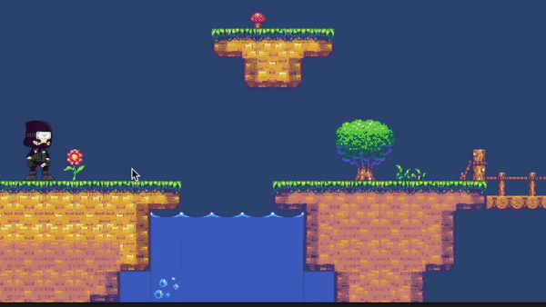
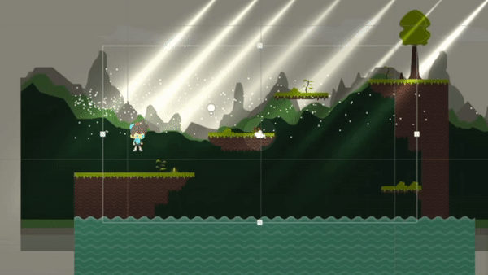

## Hi there 👋, I'm Thomas

  
  
  
  
  
  

\
**🎮 Game Developer | 💻 Full Stack Developer**

I'm a passionate programmer who enjoys facing challenges every now & then. 
Some times I like to "Re-invent the wheel", just to learn how things work internally.  
In my free time, I go through Open Source repositories to suggest improvements/bugs.

- 🔭 I’m currently working on Game Development Tools
- 💬 Ask me about Gamedev, Web Design, Competitive Programming
- ⚡ Fun fact: I ♥️ Functional Programming

## Technologies I know :

### Programming Languages

   

### Web Development

### Tic Tac Toe - Multiplayer
Project Link: [https://github.com/be-thomas/tictactoe](https://github.com/be-thomas/tictactoe)

Play Online: [http://tictactoe.be-thomas.com/](http://tictactoe.be-thomas.com/)

<video style="height: 60vh;" autoplay loop muted><source src="https://be-thomas.com/videos/tictactoe.mp4"></video>

### Mobile UI Mockup
Checkout online: [https://mobile-anim.be-thomas.com/](https://mobile-anim.be-thomas.com/)

### Hitwicket Website
Checkout online: [https://hitwicket.com/](https://hitwicket.com/)

### Infobility Website
Checkout online: [https://infobility.ca/](https://infobility.ca/)

### Game Development
- 
 Love2D 

- 
 Unity 

- 
 Godot 

- 
 Panda3D 

- 
Solar2D 

- 
 pygame 

## Games built by me

### Memory Puzzle CLI
Project Link: [https://github.com/be-thomas/memory-puzzle](https://github.com/be-thomas/memory-puzzle)

### Memory Puzzle GUI
Project Link: [https://github.com/be-thomas/memory-puzzle](https://github.com/be-thomas/memory-puzzle)

### Other Game Demo Previews

P.S. : Stay tuned for more!
