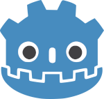
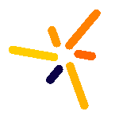
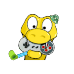

## Hi there 👋, I'm Thomas

  
  
  
  

\
**🎮 Game Developer | 💻 Full Stack Developer**

I'm a passionate programmer who enjoys facing challenges every now & then.
Some times I like to "Re-invent the wheel", just to learn how things work internally. 
In my free time, I go through Open Source repositories to suggest improvements/bugs.

- 🔭 I’m currently working on Game Development Tools
- 💬 Ask me about Gamedev, Web Design, Competitive Programming
- ⚡ Fun fact: I like Functional Programming

## Technologies I know :

### Programming Languages

   

### Game Development
- 
 Love2D 

- 
 Unity 

- 
 Godot 

- 
 Panda3D 

- 
Solar2D 

- 
 pygame 

